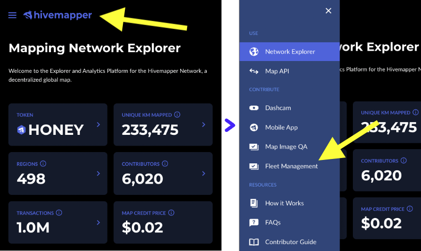

# Fleet Management for the Hivemapper Network

This README will serve as an explainer on creating a Hivemapper fleet, adding driver accounts to your Hivemapper fleet, setting and changing token splits, and locking dashcam access to your fleet of drivers.

## Creating a Hivemapper Fleet

TODO
A Hivemapper fleet is created at the time of [adding a driver](#adding-a-driver) to your fleet. Once a driver has been imported to your fleet, your Solana address is then tagged as a fleet manager by Hivemapper. This Solana address is the owner of the fleet, and will always have complete control over this fleet.

### Adding a Driver

In the [Hivemapper Explorer](https://hivemapper.com/explorer), open the menu and select Fleet Management. 
Now that you're in your fleet dashboard, you're ready to add your first driver. Click on the "+Add a Member" button to get started.
You can assign them a name, to help you keep your fleet organized. Then paste in the Solana address of the driver you'd like to add. The driver will need to provide this to you after they have set up their [Phantom](https://phantom.app) wallet.

> **Note**
> The driver must use a brand new Solana address that has never connected to Hivemapper when joining a fleet. If they have connected in any way to Hivemapper with this address, it will not allow them to join your fleet, and they will need to give you a new address to be added with.

You will then be presented a QR code, as well as a button to copy a link which you must send to the driver. THe driver can either scan the QR code on their phone, or open the link on their device where they have Phantom installed, and sign the requests to join your fleet.

> **Warning**
> The driver will need to accept your request to join your fleet within 10 minutes of starting this step.

This is what the driver will see once they've opened the link you have provided them:

Once they have joined, you will now see their account in your fleet dashboard view in the Hivemapper Explorer.

#### [PENDING] Promoting a Driver to Manager
Within the fleet dashboard of the Hivemapper Explorer, you'll be able to promote any driver listed within your fleet to manager status. Soon, this will allow these managers to add, modify and remove an [Access Control List](#access-control-list) from a dashcam. They will also be able to add drivers to the fleet, to promote a driver to manager, and to change the token split for a driver. These additional functionalities for a promotoed Manager will be available soon.

## Token Splits

To set the token split for a driver's account, go to the fleet dashboard view of the [Hivemapper Explorer](https://hivemapper.com/explorer). In the right column, you'll find the the current token split for each driver. Click into the text box for the driver you'd like to change, and enter the amount that you'd like them to keep. You'll see at the top of this column that this split is denoted as DRIVER / OWNER.

For example, a token split of 0 will send all earned HONEY to your fleet owner account, while a token split of 25 will send 25% of earned HONEY to the driver and 75% to your fleet owner account. You can input any whole number between 0 and 100, inclusively.

This value can be edited at any time, and will be applicable as of the next payout period.

Each driver will be able to see the value set for the token split within the Hivemapper mobile application. 

## Access Control List

The Access Control List (ACL) is a list of Solana addresses that you'd like to grant access to connect to any dashcams within your fleet that you'd like to lock access to. The main reason for locking access would be for ensuring that a driver does not use their own account to earn HONEY rewards while using your dashcam, as well as to deter theft (as a thief would not be able to use a locked dashcam). 

> **Note**
> When adding an ACL to a camera, you will require a live cellular connection, as well as the WiFi connection to the camera.

#### Creating an ACL
Within the fleet dashboard, you can select any and all members that you'd like to have added to your ACL. At the moment, only the fleet owner is able to modify who can be added to the ACL.

#### Adding an ACL to a Dashcam
To add the ACL to a dashcam, you must connect a mobile phone to the dashcam you'd like to lock, while being connected to either the fleet owner account (or soon with any account that has been set as a manager within the fleet). 

Within the Hivemapper phone application, once signed in, you should see that your account is designated as a fleet manager and you'll have a toggle with which you can choose to lock the camera. When selecting to lock it, the application will pull the ACL in its current state from Hivemapper and write the ACL to the dashcam. This means that if you were to add a new account to your fleet's ACL after this has been done, that new address **WILL NOT** be added to the dashcam's ACL (you would need to modify the ACL on the dashcam using the steps below).

You may potentially receive an error, requesting for you to Refresh your connection to lock/unlock the camera. This happens when your conncetion to Phantom happened too long ago. Simply press the Refresh button, and re-authenticate with Phantom to gain access to the Lock Dashcam toggle.

#### Modifying the ACL on a Dashcam
To modify the ACL on a dashcam, you'll first need to set the desired whitelisted accounts in the fleet dashboard view of the [Hivemapper Explorer](https://hivemapper.com/explorer). Then you'll need to connect a mobile phone to the dashcam while being connected to the fleet owner account (or soon any account that has been set as a manager within the fleet). Note that the ACL that is already written to the dashcam will contain the list of managers and drivers that were set on the fleet *at the time when it was loaded onto the dashcam*. This means that if a driver has been promoted to manager within your fleet during the time since the ACL was loaded to the dashcam, they **will not** be able to modify the ACL (only those listed as managers at that point would have access). 

While paired with the dashcam, if you unlock the camera and then re-lock the camera, the new ACL will be retrieved from Hivemapper and loaded onto the dashcam.

#### Removing the ACL from a Dashcam
To remove the ACL from a dashcam, you'll need to connect a mobile phone to the dashcam while being connected to either the fleet owner account (or soon any account that was set as a manager within the fleet). Note that the ACL that is already written to the dashcam will contain the list of managers and drivers that were set on the fleet *at the time when it was loaded onto the dashcam*. This means that if a driver has been promoted to manager within your fleet during the time since the ACL was loaded to the dashcam, they **will not** be able to remove the ACL (only those listed as managers at that point would have access). 

Once the Hivemapper mobile application shows the camera as being unlocked, it will be freely useable by anyone who connects to it.
